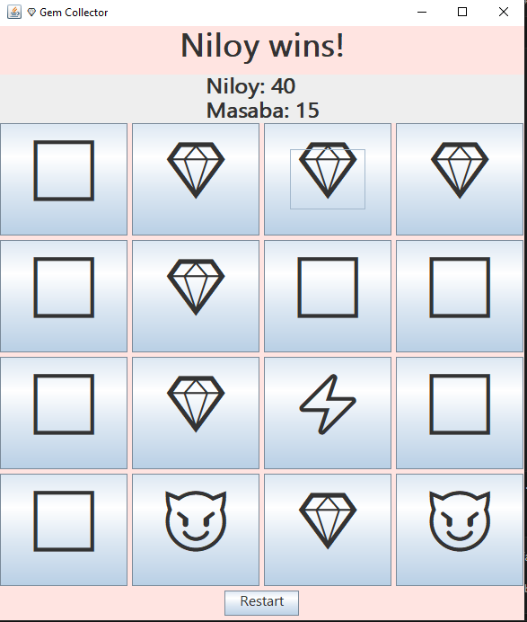

# GenQuest – Gem Collector Game

**GenQuest is a thrilling 2-player Java Swing game where you explore a 4×4 grid, collect shiny Gems 💎, grab Bonus ⚡ points, and dodge tricky Traps 😈!**  
This project demonstrates **OOP principles** and uses **Design Patterns** to keep the code modular and maintainable.  

---

## Features

- 🎮 **2-Player Turn-Based Gameplay** — take turns revealing cells.  
- 💎 **Collect Gems** to increase your score.  
- ⚡ **Bonus Cells** give extra points and an extra turn.  
- 😈 **Traps** reduce points and add challenge.  
- 🔁 **Restart Game** button to start a new round anytime.  
- 🖥️ **Clean GUI** with fun emoji symbols.  
- 👀 **Dynamic Scoreboard** updates in real time.  

---

## 📁 Project Structure

```
GenQuest/
├── App.java
├── GameManager.java
├── Cell.java
├── CellFactory.java
├── GemCell.java
├── BonusCell.java
├── TrapCell.java
├── EmptyCell.java
├── Player.java
├── ScoreBoard.java
├── Observer.java
├── Subject.java
├── Colors.java
├── README.md
└── images/
    └── game-interface.png
```

---

##   Preview

### 💎 Game Interface
Below is a screenshot of the GenQuest game in action:



- Click on cells to reveal **Gems 💎**, **Bonus ⚡**, **Traps 😈**, or **Empty ⬜** cells.  
- **Bonus cells** give an extra turn and extra points.  
- **Traps** deduct points from the current player.  
- The game ends when all cells are revealed. The player with the **highest score wins**.

---

## How to Run

Follow these steps to run Themed Tic-Tac-Toe:

1. **Open Terminal / Git Bash / Command Prompt** in the project folder  `GenQuest`.

2. **Compile all Java files** by running:
      
       bash
       javac *.java
      

3. **Run the game with:**
 java App

4. The Gem Collector window will open.

     - Click on grid cells to reveal Gems, Bonus, Traps, or Empty cells.

     - Bonus cells give an extra turn; Traps reduce points.

     - The player with the highest score wins.

---

## Technologies Used

- **Java** – programming language for core logic 

- **Swing** – graphical user interface (GUI)

- **Object-Oriented Programming (OOP)** – classes, inheritance, encapsulation

- **Design Patterns** – for modular and maintainable code